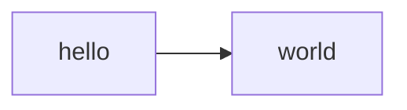

# Welcome to documentations from my project: 
## Extract from SQL Server and Load to DuckDB

# Diagramas

# Reference

## ETL

### Extract Function
::: app.etl.extract_from_sql_server

::: app.extract_validation.read_from_duckdb_and_show